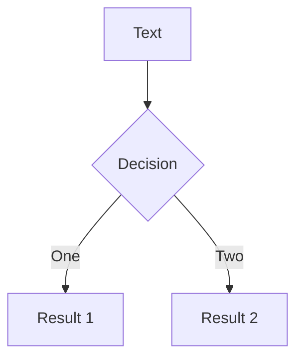
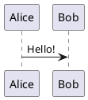

#### [Block Frontmatter](https://sli.dev/features/block-frontmatter.html)

#Syntax

````md
---
theme: default
---

# Slide 1

---

```yaml
layout: quote
```

# Slide 2

---

# Slide 3
````

#### [Building and Hosting](https://sli.dev/guide/hosting)

#### [Click Markers](https://sli.dev/features/click-marker.html)

#Presenter #Animation 

```md
<!--
Content before the first click

[click] This will be highlighted after the first click

Also highlighted after the first click

- [click] This list element will be highlighted after the second click

[click:3] Last click (skip two clicks)
-->
```

#### [Draggable Elements](https://sli.dev/features/draggable.html)

#Layout 

```md
# Directive - Data from the frontmatter

---
dragPos:
  square: Left,Top,Width,Height,Rotate
---


```

```md
# Directive - Data from the directive value


```

```md
# Component - Data from the frontmatter

---
dragPos:
  foo: Left,Top,Width,Height,Rotate
---

<v-drag pos="foo" text-3xl>
  <div class="i-carbon:arrow-up" />
  Use the `v-drag` component to have a draggable container!
</v-drag>
```

```md
# Component - Data from props

<v-drag pos="Left,Top,Width,Height,Rotate" text-3xl>
  <div class="i-carbon:arrow-up" />
  Use the `v-drag` component to have a draggable container!
</v-drag>
```

```md
# Draggable Arrow

<v-drag-arrow />
```

#### [Drawing & Annotations](https://sli.dev/features/drawing.html)

#Drawing 

```md
---
drawings:
  persist: true
  presenterOnly: true
  # enabled: false
  # enabled: dev
---
```

#### [Eject Theme](https://sli.dev/features/eject-theme.html)

#Theme #CLI 

```md
---
theme: ./theme
---
```

```sh
slidev theme eject
```

#### [Frontmatter & Headmatter](https://sli.dev/guide/syntax#frontmatter)

```md
---
theme: seriph
title: Welcome to Slidev
---

# Slide 1

The frontmatter of this slide is also the headmatter

---
layout: center
background: /background-1.png
class: text-white
---

# Slide 2

A page with the layout `center` and a background image

---

# Slide 3

A page without frontmatter

---
src: ./pages/4.md  # This slide only contains a frontmatter
---

---

# Slide 5
```

#### [Frontmatter Merging](https://sli.dev/features/frontmatter-merging.html)

#Syntax 

```md title="./slides.md"
---
src: ./cover.md
background: https://sli.dev/bar.png // [!code highlight]
class: text-center
---
```
```md title="./cover.md"
---
layout: cover
background: https://sli.dev/foo.png // [!code highlight]
---

# Cover

Cover Page
```

Will be:

```md
---
layout: cover
background: https://sli.dev/bar.png // [!code highlight]
class: text-center
---

# Cover

Cover Page
```

#### [Generate PDF when Building](https://sli.dev/features/build-with-pdf.html)

#Export #Build

```md
---
download: true
# download: 'https://remote.com/skip-render.pdf'
---
```

#### [Global Layers](https://sli.dev/features/global-layers.html)

#Navigation #Layout 

```html
<!-- global-bottom.vue -->
<template>
  <footer class="absolute bottom-0 left-0 right-0 p-2">Your Name</footer>
</template>
```

```html
<!-- custom-nav-controls -->
<template>
  <button class="icon-btn" title="Next" @click="$nav.next">
    <div class="i-carbon:arrow-right" />
  </button>
</template>
```

```html
<!-- hide the footer from Page 4 -->
<template>
  <footer
    v-if="$nav.currentPage !== 4"
    class="absolute bottom-0 left-0 right-0 p-2"
  >
    Your Name
  </footer>
</template>
```

```html
<!-- hide the footer from "cover" layout -->
<template>
  <footer
    v-if="$nav.currentLayout !== 'cover'"
    class="absolute bottom-0 left-0 right-0 p-2"
  >
    Your Name
  </footer>
</template>
```

```html
<!-- an example footer for pages -->
<template>
  <footer
    v-if="$nav.currentLayout !== 'cover'"
    class="absolute bottom-0 left-0 right-0 p-2"
  >
    {{ $nav.currentPage }} / {{ $nav.total }}
  </footer>
</template>
```

```html
<!-- custom-nav-controls -->
<!-- hide the button in Presenter model -->
<template>
  <button v-if="!$nav.isPresenter" class="icon-btn" title="Next" @click="$nav.next">
    <div class="i-carbon:arrow-right" />
  </button>
</template>
```

#### [Icons](https://sli.dev/features/icons.html)

#Components

```html
<uim-rocket />
<uim-rocket class="text-3xl text-red-400 mx-2" />
<uim-rocket class="text-3xl text-orange-400 animate-ping" />
```

#### [Import Code Snippets](https://sli.dev/features/import-snippet.html)

#Codeblock #Syntax 

```md
<<< @/snippets/snippet.js#region-name ts {monaco}{height:200px}
<<< @/snippets/snippet.js {2,3|5}{lines:true}
<<< @/snippets/snippet.js {*}{lines:true}
```

#### [Importing Slides](https://sli.dev/features/importing-slides.html)

#Syntax 

````markdown title="./slides.md"
# Title

This is a normal page

---
src: ./pages/toc.md // [!code highlight]
---

<!-- this page will be loaded from './pages/toc.md' -->

Contents here are ignored

---

# Page 4

Another normal page

---
src: ./pages/toc.md   # Reuse the same file // [!code highlight]
---
````

````md title="./pages/toc.md"
# Table of Contents

Part 1

---

# Table of Contents

Part 2
````

Import file:

````md
---
src: ./another-presentation.md#2,5-7
---
````

#### [LaTeX](https://sli.dev/features/latex.html)

#Codeblock #Syntax 

```md
$\sqrt{3x-1}+(1+x)^2$
```

```latex
$$ {1|3|all}
\begin{aligned}
\nabla \cdot \vec{E} &= \frac{\rho}{\varepsilon_0} \\
\nabla \cdot \vec{B} &= 0 \\
\nabla \times \vec{E} &= -\frac{\partial\vec{B}}{\partial t} \\
\nabla \times \vec{B} &= \mu_0\vec{J} + \mu_0\varepsilon_0\frac{\partial\vec{E}}{\partial t}
\end{aligned}
$$
```

#### [Layout](https://sli.dev/guide/layout)

```md
---
layout: quote
---
```

#### [Line Highlighting](https://sli.dev/features/line-highlighting.html)

#Codeblock #Animation 

````md
```ts {none|2-3|5|all|hide}
function add(
  a: Ref<number> | number,
  b: Ref<number> | number
) {
  return computed(() => unref(a) + unref(b))
}
```
````

#### [Line Numbers](https://sli.dev/features/code-block-line-numbers.html)

````md
```ts {6,7}{lines:true,startLine:5}
function add(
  a: Ref<number> | number,
  b: Ref<number> | number
) {
  return computed(() => unref(a) + unref(b))
}
```
````

````md
```ts {*}{lines:true,startLine:5}
// ...
```
````

#### [Max Height](https://sli.dev/features/code-block-max-height.html)

#Codeblock #Layout 

````md
```ts {2|3|7|12}{maxHeight:'100px'}
function add(
  a: Ref<number> | number,
  b: Ref<number> | number
) {
  return computed(() => unref(a) + unref(b))
}
/// ...as many lines as you want
const c = add(1, 2)
```
````

````md
```ts {*}{maxHeight:'100px'}
// ...
```
````

#### [MDC Syntax](https://sli.dev/features/mdc.html)

#Syntax #Styling 

```mdc
---
mdc: true
---

This is a [red text]{style="color:red"} :inline-component{prop="value"}

{width=500px lazy}

::block-component{prop="value"}
The **default** slot
::
```

#### [Mermaid Diagrams](https://sli.dev/features/mermaid.html)

#Diagram 

````md

````

#### [Monaco Editor](https://sli.dev/features/monaco-editor.html)

#Codeblock #Editor 

````md
```ts {monaco}
console.log('HelloWorld')
```
````

#### [Monaco Runner](https://sli.dev/features/monaco-run.html)

#Codeblock #Editor

```ts {monaco-run}
function distance(x: number, y: number) {
  return Math.sqrt(x ** 2 + y ** 2)
}
console.log(distance(3, 4))
```

#### [Navigation Direction Variants](https://sli.dev/features/direction-variant.html)

#Navigation #Styling 

```css
/* example: delay on only forward but not backward */
.slidev-nav-go-forward .slidev-vclick-target {
  transition-delay: 500ms;
}
.slidev-nav-go-backward .slidev-vclick-target {
  transition-delay: 0;
}
```

```html
<div v-click class="transition forward:delay-300">Element</div>
```

#### [Notes](https://sli.dev/guide/syntax#notes)

```md
---
layout: cover
---

# Slide 1

This is the cover page.

<!-- This is a **note** -->

---

# Slide 2

<!-- This is NOT a note because it is not at the end of the slide -->

The second page

<!--
This is _another_ note
-->
```

#### [PlantUML Diagrams](https://sli.dev/features/plantuml.html)

#Diagram

````md

````

#### [Rough Markers](https://sli.dev/features/rough-marker.html)

#Drawing #Animation

```vue
<span v-mark="{ at: 5, color: '#234', type: 'circle' }">
Important text
</span>
```

#### [Shiki Magic Move](https://sli.dev/features/shiki-magic-move.html)

#Codeblock #Animation 

````md magic-move
```js
console.log(`Step ${1}`)
```
```js
console.log(`Step ${1 + 1}`)
```
```ts
console.log(`Step ${3}` as string)
```
````

````md magic-move {at:4, lines: true} // [!code hl]
```js {*|1|2-5} // [!code hl]
let count = 1
function add() {
  count++
}
```

Non-code blocks in between as ignored, you can put some comments.

```js {*}{lines: false} // [!code hl]
let count = 1
const add = () => count += 1
```
````

#### [Slide Canvas Size](https://sli.dev/features/canvas-size.html)

#Layout 

```md
---
# aspect ratio for the slides
aspectRatio: 16/9
# real width of the canvas, unit in px
canvasWidth: 980
---

# Your slides here
```

#### [Slide Hooks](https://sli.dev/features/slide-hook.html)

#Client-API

```ts
import { onSlideEnter, onSlideLeave, useIsSlideActive } from '@slidev/client'

const isActive = useIsSlideActive()

onSlideEnter(() => {
  /* Called whenever the slide becomes active */
})

onSlideLeave(() => {
  /* Called whenever the slide becomes inactive */
})
```

#### [Slide Scope Styles](https://sli.dev/features/slide-scope-style.html)

#Styling #Syntax

```md
# Slidev

> Hello **world**

<style>
blockquote {
  strong {
    --uno: 'text-teal-500 dark:text-teal-400';
  }
}
</style>
```

#### [Slot Sugar for Layouts](https://sli.dev/features/slot-sugar.html)

#Layout #Syntax 

```md
---
layout: two-cols
---

::right::

# Right

This shows on the right

::default::

# Left

This is shown on the left
```

#### [The `Transform` Component](https://sli.dev/features/transform-component.html)

#Layout

```md
<Transform :scale="0.5">
  <YourElements />
</Transform>
```

#### [Theme and Addons](https://sli.dev/guide/theme-addon)

```md
---
theme: seriph
addons:
  - '@slidev/plugin-notes'
---
```

#### [TwoSlash Integration](https://sli.dev/features/twoslash.html)

#Codeblock

````md
```ts twoslash
import { ref } from 'vue'

const count = ref(0)
//            ^?
```
````

#### [Writable Monaco Editor](https://sli.dev/features/monaco-write.html)

#Codeblock #Editor

```md
<<< ./some-file.ts {monaco-write}
```

#### [Zoom Slides](https://sli.dev/features/zoom-slide.html)

#Layout

```md
zoom: 0.8
```

